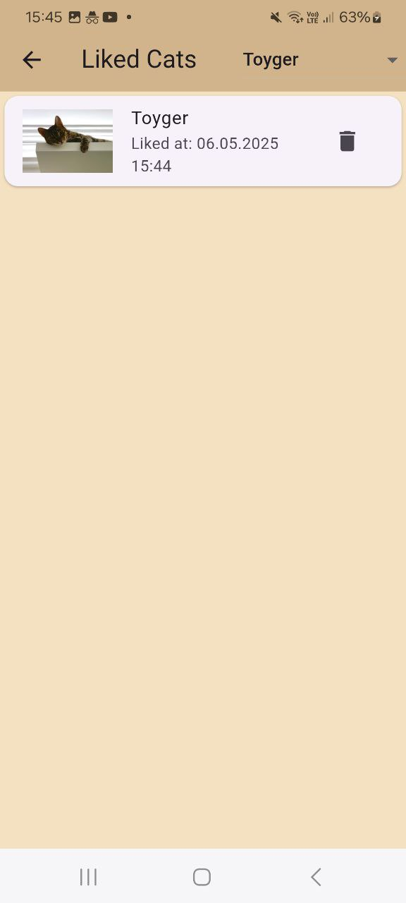

# Match Your Kitty

Найди себе того самого котика! 

Описание: это мобильное приложение, которое действует по системе tinder, но с прекрасными и милыми котиками! Если тебе понравился котик, то свайпни его вправо или нажми лайк, если котик показался тебе некрутым(как такое возможно??), то свайпни влево или нажми дизлайк. Более того! Ты можешь нажать на карточку, чтобы увидеть данные про его породу

Реализованные фичи:

1.	На главном экране отображается случайное изображение котика и название его породы
2.	Изображение котика можно смахнуть влево или вправо
3.	Есть две кнопки: лайк/дизлайк
4.	Смахивание, свайп или нажатие на кнопку сменяет котика на нового
5.	Если котика лайкнули (лайк или свайп вправо), то на экране увеличивается счетчик
6.	Если нажать на само изображение котика, то открывается новый экран с детальным описанием
7.	На экране детального описания отображается то же изображение котика, плюс отображается вся информация про породу.
8. На главном экране присутствует кнопка открытия экрана лайкнутых котиков: изображение, название породы, дата.
9. Присутствует раскрывающийся список для фильтрации по породам, присутствующим в списке.
10. У каждого элемента списка присутствует кнопка для удаления котика из списка лайкнутых

Ссылка для скачивания apk

[тык](app-release.apk)

Изображение интерфейса
1. 

2. 

3. 

4. 

5. 

6. 

7. 

8. 

9. 

10. 

11. 

12. 